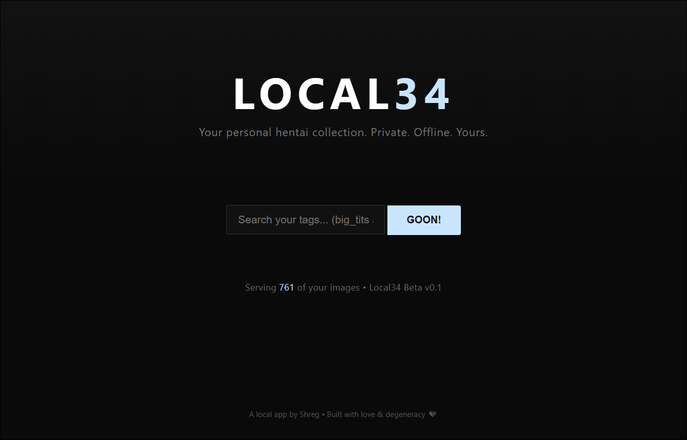

**License**: Proprietary — Personal use only. All rights reserved.

# Local34

**Your personal offline media gallery.**

Private. Fast. Built for collectors.

## Features

- Smart AI tagging (powered by state-of-the-art models)
- Automatic duplicate detection + smart renaming
- Continuous folder watching — just drop files and go
- Powerful search with autocomplete
- Full support for images, GIFs, and videos
- Beautiful desktop interface

## Quick Start

1. Download the latest release
2. Run `Local34.exe`
3. Drop your media into the `media/totag` folder
4. Let it work its magic
5. Search and browse your collection

## Why Local34?

Designed for people who want full control over their collection.  
Completely offline. No accounts. No cloud. No tracking.

Works best with anime, 2D, and stylized artwork.

## Tech Stack

- AI tagging via WD14 (moat-tagger)
- Desktop window powered by pywebview
- Perceptual hashing for duplicates
- Local ffmpeg for video thumbnails

---

Made with love (and a lot of caffeine) by Shreg (Creator of KohlLabs).

**All Rights Reserved — Personal use only.**
